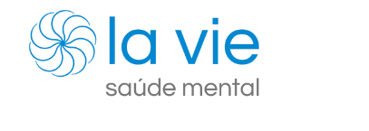

<h4 align="center"><strong>La Vie - Saúde Mental<strong></h4>

 
Desafio Hacker - Hands On 3

 

## 📕 Indice

* [📋 Enunciado](#📋-enunciado)
* [🖥 Tecnologias](#🖥-Tecnologias)
* [🔍 Documentação API](#🔍-documentação-api-la-vie)
* [👤 Grupo](#👤-grupo)

## 📋 Enunciado

Um grupo de psicólogos se juntaram e criaram a
clínica La Vie - Saúde Mental que oferece
diversos tipos de terapia. 
Para ajudar nos atendimentos, eles precisam de uma API que permita criar registros de
psicólogos, pacientes e prontuários.

## 🖥 Tecnologias

## 🔍 Documentação API LA VIE
 
 [Link](https://documenter.getpostman.com/view/23358684/2s7YfNBEzN) da documentação da nossa API 

## 👤 Grupo
- Carlos Henrique Sodre gomes
- Irandy Paiva
- Jessica Leal
- Laura Santos
- Victor Hugo